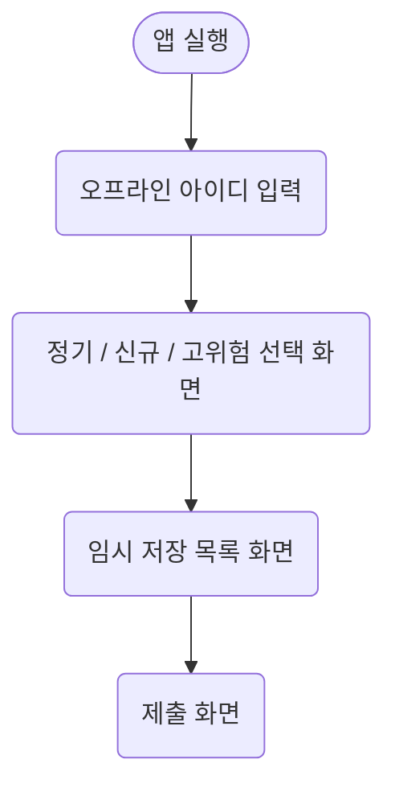

# 화면 Flow

## 일반

```mermaid
flowchart TD
    a([앱 실행]) --> b(오프라인 아이디 입력)
    b --> c(정기 / 신규 / 고위험 선택 화면)
    c --> d(임시 저장 목록 화면)
    d --> e(제출 화면)
```

# 화면 목록

## 아이디 입력 화면

## 정기 / 신규 선택 화면

## 목록 화면

## 입력 화면

## 제출 화면

