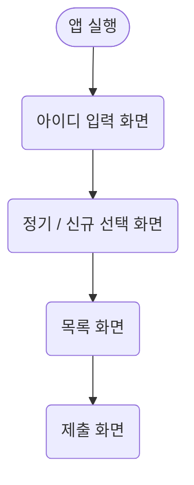
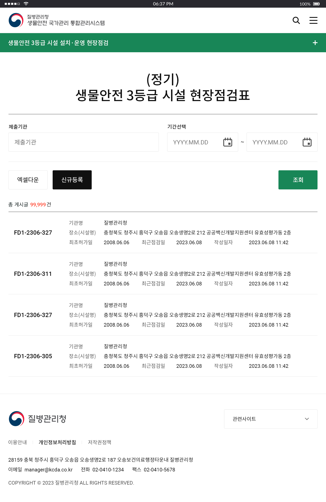
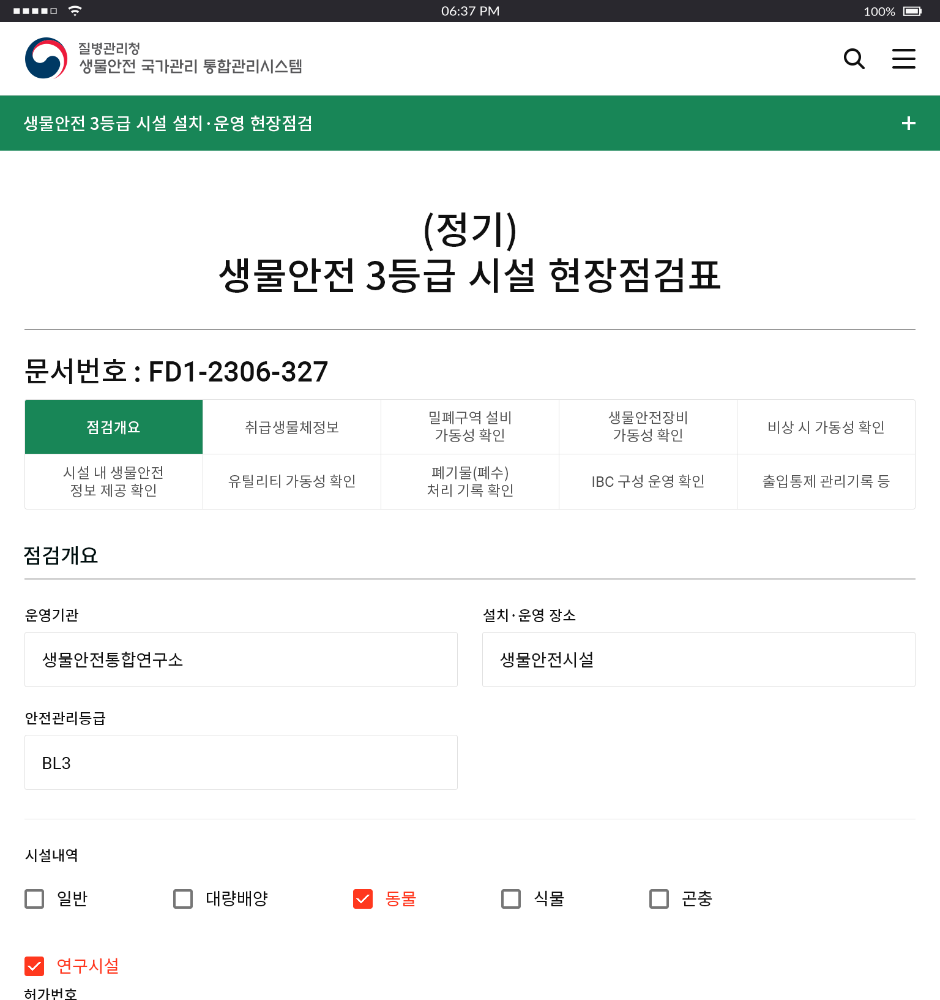
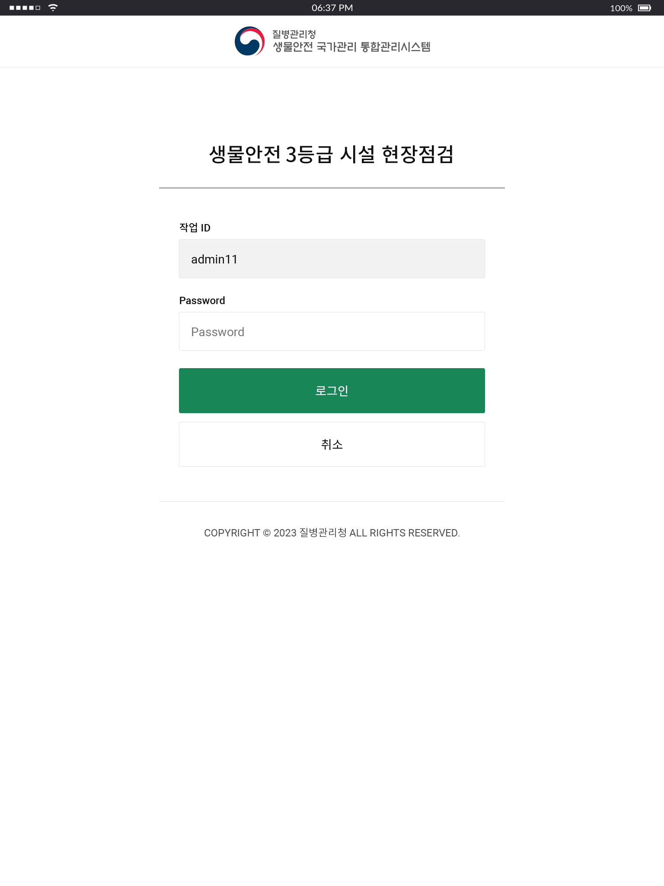

# 화면 Flow

## 일반

```mermaid
flowchart TD
    appRun([앱 실행]) --> enterID(아이디 입력 화면) --> selectFormType(정기 / 신규 선택 화면) --> selectedFormList(목록 화면) --> submit(제출 화면)
```

# 화면 목록

## 아이디 입력 화면

## 정기 / 신규 선택 화면

## 목록 화면

## 입력 화면

## 제출 화면

