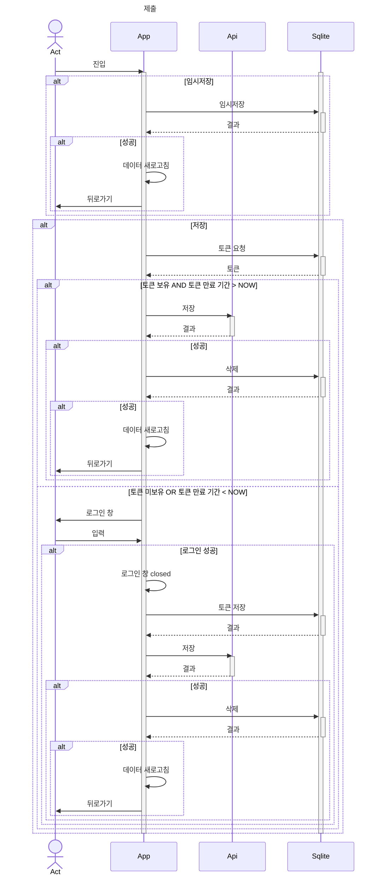

```mermaid
---
title : 제출
---
sequenceDiagram
    actor act as Act
    participant app as App
    participant api as Api
    participant sql as Sqlite
    act ->> app: 진입
    activate app
    activate sql
    alt 임시저장
        app ->> sql: 임시저장
        activate sql
        sql -->> app: 결과
        deactivate sql
        alt 성공
            app ->> app: 데이터 새로고침
            app ->> act: 뒤로가기
        end
    end

    alt 저장
        app ->> sql : 토큰 요청
        activate sql
        sql -->> app : 토큰
        deactivate sql
        alt 토큰 보유 AND 토큰 만료 기간 > NOW
        
            app ->> api: 저장
            activate api
            api -->> app: 결과
            deactivate api
            alt 성공
                app ->> sql: 삭제
                activate sql
                sql -->> app: 결과
                deactivate sql

                alt 성공
                    app ->> app: 데이터 새로고침
                    app ->> act: 뒤로가기
                end
            end
        else 토큰 미보유 OR 토큰 만료 기간 < NOW
            app ->> act: 로그인 창
            act ->> app: 입력
            alt 로그인 성공
                app ->> app: 로그인 창 closed
                app ->> sql: 토큰 저장
                activate sql
                sql -->> app: 결과
                deactivate sql
                app ->> api: 저장
                activate api
                api -->> app: 결과
                deactivate api
                alt 성공
                    app ->> sql: 삭제
                    activate sql
                    sql -->> app: 결과
                    deactivate sql
                    alt 성공
                        app ->> app: 데이터 새로고침
                        app ->> act: 뒤로가기
                    end
                end
            end
        end

    end
    deactivate app
    deactivate sql
```

